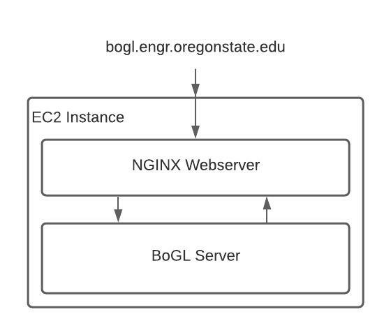

# Deployment

In this section we'll discuss the final aspect of the BoGL stack, the live deployment that constitutes bogl.engr.oregonstate.edu.

Jumping right into it, the live deployment runs on an AWS EC2 instance. On this instance we run the boglserver behind an NGINX webserver that routes requests to and from boglserver. The EC2 instance itself is reachable via a static IP, one which we have OSU's IT department pointing the 4th level domain bogl.engr.oregonstate.edu to. We use an outside server instead of OSU's equipment due to their restrictions on running custom servers. There are no limitations to how many deployments we could have, but this primary one has proven to be the most successful at making BoGL accessible.

## AWS



If you are going to be doing dev-ops on the EC2 instance, you should be familiar with working in the command line, and you should also have familiarity with working on Amazon's framework. You can read some more about working with [EC2 instances](https://aws.amazon.com/ec2/getting-started/), which can be helpful for understanding how to work with this setup.

The first thing you'll need to be able to do is access the server directly via ssh. In order to do this, you can request to have yourself added to the shared AWS account with the ID 2094-6213-3621 via coe.support@oregonstate.edu, or you can request an existing team-member with access (like Dr. Parham-Mocello) to login via https://login.oregonstate.edu/apps/aws/ and grant you access to the server. The primary **ubuntu** user account is what is used to control most of the system features, and you should be able to ask Ben @ friedman.benjamin@gmail.com (person who originally set this all up) to have yourself added to this account as needed.
```bash
ssh ubuntu@bogl.engr.oregonstate.edu
# or
ssh yourotheracct@bogl.engr.oregonstate.edu
```

Generally, you'll want to have access to the server under **ubuntu** as well as having access to the AWS control panel (through the login link mentioned above). The control panel is used to stop, start, and reconfigure the instance. Since the account is shared there are other instances as well, so you can look for **ACTIVE_BoGL_Box** as the live deployment. **Dev_BoGL_Box** is a similar environment used for testing new changes that might be risky on the live environment. You shouldn't need to interact with any of the other boxes.

## General Management

Once you're setup on the new machine there are a couple of tasks that you may need to do:
- updating boglserver
  - can be done using the script `fireup.sh` from `/home/ubuntu/` (this is akin to the rebuild-reboot.sh script in the [scripts repo](https://github.com/The-Code-In-Sheep-s-Clothing/bogl-deploy-scripts))
- update the website (bogl-editor)
  - also can be done via `fireup.sh`
- restarting boglserver
  - `auto_restart.sh` from `/home/ubuntu/`, which reboots without rebuilding anything

As a note, when rebooting the entire AWS instance itself, the server and related functionality will automatically reboot itself as well.

In some cases, you may find that there is a 'configuration' error or a similar message when trying to reach the bogl website. If this occurs, it's often associated with a subtle issue in NGINX. Running `nginx -s reload` is usually sufficient to reset the error. If this still doesn't resolve the error, and you can determine that `boglserver` is running normally, you will need to [inspect the logs](https://logtail.com/tutorials/how-to-view-and-configure-nginx-access-error-logs/) associated with nginx to see if there is a configuration error. If there is, and nginx won't reload or reboot, you can often see the specific issue outlined here.

In relation to the above, the nginx configuration that determines how to server the bogl website and server API together is done via the `/etc/nginx/sites-available/bogl_engr_oregonstate_edu` configuration file (note, this file requires root access to change). Unless you are reworking the API, changing the caching behavior, or some other server related adjustment, you will probably not need to work with this.

NGINX itself can also be a beast, so if you're unfamiliar with it we recommend going through their documentation to understand [what it is and how it works](https://www.nginx.com/resources/wiki/start/). If you're not going to be doing any configuration changes, it's helpful to at least know how to stop, start, and reload nginx.
```bash
# start nginx if isn't running already
nginx

# reload with any new configuration changes
# also tends to refresh the server, and iron out
# any issues that have popped up
nginx -s reload

# stop the nginx process (you will probably not need this one)
nginx -s stop
```

## Maintaining the SSL Certificate

You may have been wondering why we have *two* servers, boglserver and nginx. The simple explanation is that we need to secure the communication between the client and our AWS instance, especially since the users of BoGL are a mix of students and teachers. There are two connections, one from the client to NGINX, and another from NGINX to boglserver. Given that the connection from NGINX to boglserver is conducted locally on the same machine, the connection we need to secure is the one that exists from the client to NGINX; the one over the internet and outside our AWS box.

This is *especially* critical considering that users may be minors, and as such their data needs to be protected.

Our SSL certificate to secure the connection to bogl.engr.oregonstate.edu is issued from [Lets Encrypt](https://letsencrypt.org/), a non-profit CA that has been issuing quality certificates for some time now. They have a command line utility that we use periodically to update our certs, which is done automatically. However, in the event that the cert is not renew on time, you can renew it by hand.
```bash
# renew any local certs via 'certbot'
# this should renew our issued cert for bogl.engr.oregonstate.edu
certbot renew

# reload nginx to apply new the renewed certs
nginx -s reload
```
If the cert was outdated, this should immediately rectify the issue. In most cases, this should not be an issue, but it is important to keep in mind.

## Updating the Documentation

The documentation you're reading now is also held on the same site, but in a different location under `nelsonai`'s account. You can update the documentation by running the following commands as that user in their home folder.
```bash
# specifically use the following ruby version
# does not work from a script...
rvm use 2.7.1

# update the docs normally
./update_docs.sh
```

Since the docs are cloned via git, this repo is locked to only working with that user locally, but if the reader has the time this could be moved to ubuntu as well (and the nginx config would need to be changed too).

## Server Keep-Alive

Despite maintenance and updating, sometimes instances will need to be rebooted. This a normal part of the life cycle of any process. Part of this is due to the unpredictability of the requests and their content that the server receives over time. In order to prevent unforeseen issues from requests crashing the server, there is a CRON job that keeps the server alive. It's a simple solution, but it works quite well.
```bash
# auto reboot every minute
* * * * * /home/ubuntu/./auto_restart.sh >> /home/ubuntu/restarts.log
```
Even if someone manages to create a runaway BoGL program, or if the server simply exhausts itself, this will ensure it stays alive. To inspect this, you can use `crontab -e` from the ubuntu account.

## Automatic Updates

As a final note, having to maintain the server by hand can be a bit tiresome. To get around this, we setup a 3 AM automatic update that pulls down the latest version of **bogl** and the **bogl-editor** to update the server and the website together. This is also done in CRON job.
```bash
# shuts down and restarts everything at 3:00 AM PST (the server is 7 hours ahead PST), allows new updates to reach the server
0 10 * * * /home/ubuntu/./fireup.sh >> /home/ubuntu/restarts.log
```
For the most part, due to the keep-alive and the automatic nightly update, the BoGL stack is relatively maintenance free. It only needs to be watched periodically to make sure everything is okay.
