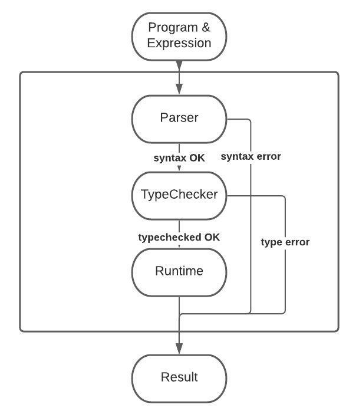

# Language Implementation

In this section we'll be talking about the implementation of BoGL itself. We'll go over the parts of the language, and the purpose each part serves. [The BoGL language is hosted on github under 'bogl'](https://github.com/The-Code-In-Sheep-s-Clothing/bogl).

BoGL is a functional domain specific teaching language written in Haskell, and it also emulates some of the syntax and semantics associated with Haskell, but to a much lesser extent (lacking first-class functions for example). Rather, it uses a simplified syntax that is intended to facilitate teaching essential computer science concepts without introducing too much overhead.

The BoGL language can be generally described in terms of the following components: the parser, the typechecker and the runtime. These parts are related like so.

This figure shows how a program and expression are fed into BoGL, starting with the parser. The parser verifies that the program can be parsed without any syntax errors, and passes control along to the typechecker if there are no problems. The typechecker verifies that a program does not have any type errors, and if the program is type-correct control is then passed to the runtime. If the parser fails to verify the syntax, a syntax error is reported and the typechecker stage is skipped. Similarly, if the typechecker fails to typecheck a program, a type error is reported and the runtime stage is skipped. Once the runtime stage is reached, the provided expression is evaluated in the context of the program, and some result is produced.

It is important to note that expressions themselves must also be parsed and type-checked in order to be evaluated. Although this is not shown in the figure above,  the runtime stage includes a smaller parsing & typechecking step for the expression itself. If either stage fails, the same rules apply and the corresponding error is reported without performing further evaluation work.

There are various modules that are used to represent these processes in the actual implementation, and we'll go over them in the following sections.

## Language

This module contains the Haskell representation of the BoGL syntax, as well as the types that are present in BoGL. The syntax and types are used to construct an abstract syntax tree representation of a BoGL program that is handled by the parser. This particular representation of BoGL syntax corresponds to a deeply embedded DSL, where we do not use the existing type system present in Haskell.

## Parser

This module contains the BoGL parser, taking a program in concrete form and attempting to produce an equivalent one as an AST. This is written using [parsec](https://hackage.haskell.org/package/parsec), a parser combinator library that allows combining several low-level parsers into one fully capable of handling a complete BoGL program.

## Typechecker

This module contains the BoGL typechecker. This takes a program as an AST which is produced by the parser, and determines whether it is type-correct. This logic is divided between the typechecker itself, and the typechecking monad file, which provides the unification algorithm to make typechecking work.

BoGL utilizes *sub-typing* to determine how to unify types. This means if we have two types `type T1 = {A}` and `type T2 = Int & T1`, we can say that all types of `T1` are sub-types of `T2`. This is used to determine if an expression evaluates to a value of a desired type. In the cases where an expression does not have the immediate type desired, we can use sub-typing to determine whether the given type is a sub-type of a suitable candidate type (like in the case of `T2`). This is also used in unification to determine whether expressions can be resolved to the same type. This is particularly useful in the case of binary operators, where the operands should often be of the same type.

## Runtime

This module contains everything needed to evaluate an expression in the context of a BoGL program. The algorithm for evaluation is described, an evaluation monad *Eval* is used, builtin functions and values that are available at runtime are defined, and the form of final values is defined as well.

The runtime module also maintains an evaluation environment with the currently defined board type. The environment is 'modified' as subsequent names are bound to values during evaluation. Functions are also bound in a similar fashion, but since they are not first-class values these are known in advance, and do not change during evaluation. To keep the environment bound to a reasonable size, we utilize a map-based implementation to correspond names and values as key/value pairs. Redeclaration of an existing name can thus shadow a previously declared one, but bindings are ultimately immutable once declared. The board type is a vestige of the original language specification, and exists to define the type of all board instances. At one time the type of boards was a required part of any program, but that has since been phased out.

## Error

This module generally contains all syntax, type, and runtime errors that are capable of being emitted from BoGL. There are cases where errors are defined locally to their module, but ideally they should all be here for easier discovery and analysis of categories of error messages.

## Utils

This module is fairly self-explanatory. It contains various non-specific helper functions that are useful across various modules, but don't belong in any one module.

## API

This module contains logic for defining a [Servant](https://haskell-servant.readthedocs.io/) web-server that defines a REST API for taking a program and an expression and producing a result. We'll explain this module later, as it's one of the last parts that links the front-end to the back-end.
