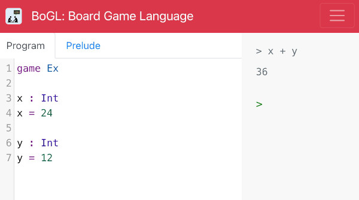
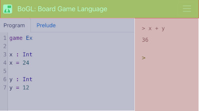
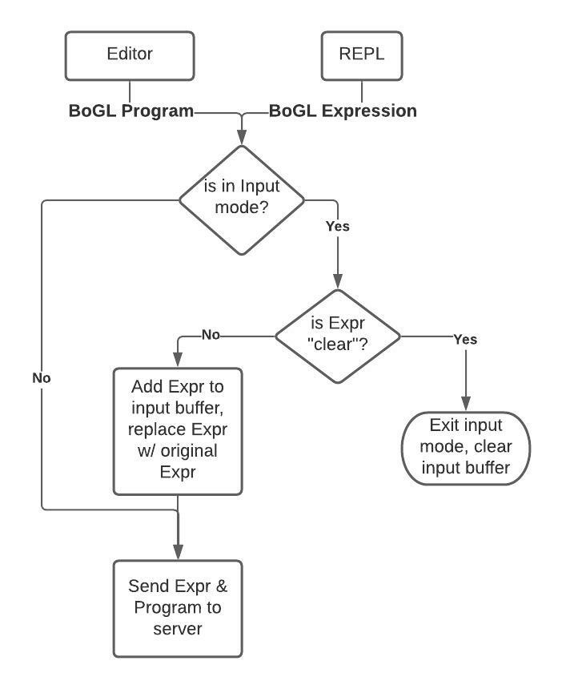
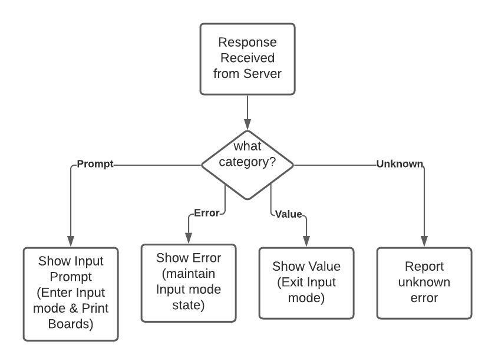

# Web Editor and REPL

The online interface is the primary means of writing and running BoGL programs, as can be seen in the images above. If you've used BoGL before, you're probably already familiar with this part of BoGL. [The repository for the website is hosted on github under the name 'bogl-editor'](https://github.com/The-Code-In-Sheep-s-Clothing/bogl-editor).

This section seeks to detail how the BoGL website is built and how it enables editing and evaluating of programs and expressions. At a high-level, the purpose of the website is to allow writing BoGL programs, writing BoGL expressions, and to send programs and expressions together to the server to evaluate them to a final result (if possible, or an error).

It is important to note that the website doesn't do any evaluation or computation work itself, this is done entirely on the server. The sole purpose of the website is to provide a UI to interact with BoGL programs and expressions, show results from the server, and to keep track of state across requests. The state that is tracked consists of the program itself (which persists across subsequent site visits), and the history of entries provided while in [input mode](https://bogl.engr.oregonstate.edu/tutorials/input.html). This is required since the server retains no state across requests.

## How it's Built

The website UI is a [React](https://reactjs.org/) application. This allows designing the interface in Typescript as separate components. Each component is used to  construct a page without laying out the raw HTML by hand. Using React, we define 3 major components that are used to build the UI: the navbar, the editor, and the REPL (also referred to as the interpreter). The colors of each of these segments associates to their color-coded locations in the image below. As an aside, REPL is short for the "Read, Evaluate, Print, Loop".

These 3 components are designed separately of each other, but are composed together to form a complete interface for working with BoGL. A singular **App.tsx** file describes the overall page layout for these components, and how they should be oriented with respect to each other. Beyond that, the rest is the piping of information to and from individual components in order to prepare requests for the server.

If you are unfamiliar with React, we would recommend putting a little time aside to read through the [React getting started tutorial](https://reactjs.org/docs/hello-world.html). If you have prior experience working with Javascript, Typescript, or a similar variant, you should be able to grasp most of React by reading through their material. In the case that you don't have this prior experience don't fret! They also have a link on the same getting started page to help teach you the fundamentals of Javascript.

## How it Works

Now that we've established the components that are used to build the website, we can detail how they all work together. Most of the functionality described here is organized in **src/Repl/Repl.tsx**. Typically, the flow of how a program and an expression from the REPL are prepared and sent to the server looks a lot like what is shown in the image below. This describes how content from the editor (a program) and content from the REPL (an expression), are combined together for requests. Once we have this data, we also need to determine whether we are currently in *input* mode. The easy case is when we are not in input mode, which allows us to simply send the current expression and program together to the server. The trickier case is when we need to send input.

To elaborate a little further, effectively, input mode allows users to interact with their programs during execution. Input mode corresponds to whether we are actively waiting to read input from the user, and indicates whether we should be evaluating the current expression by itself or adding it to the input buffer. The input buffer is a list of inputs that will be used, in order, to provide values for every input prompt. Whenever we are evaluating a BoGL expression, and we come across the expression *input*, BoGL will always check for the next entry in the input buffer to use as a value. If there is no entry, then execution is halted, and a *prompt* for further input is sent back to the website.

There is a mention in the image of an "original expr", which refers to the original expression that made us enter input mode. We need to cache this expression to send it along to the server on every request since there is no state server-side. Every evaluation is fresh, and in order to give the "feeling" that we are progressively providing input we need to re-evaluate the original expression that triggered input mode; along with all prior input values.

There is also the case of the magic keyword `clear`, which is idempotent with regard to resetting input mode to False. Whenever `clear` is typed in as an expression by itself input mode will be reset, the input buffer will be flushed, and the original expression that triggered input mode will be cleared as well. Subsequent uses of `clear` will have no further effects, and are safe to do.

Now, on the other side of how the website works we need to address how responses are handled coming back from the server. This is a tad simpler than the workflow for preparing a request. Every proper response should have a given category, and depending on the category we determine what kind of actions we need to take. For this description, we've laid out 4 major categories to go over.

When a **Prompt** is received it indicates that the expression was unable to continue evaluating, and requires user input to continue. This is akin to having an empty input buffer when an `input` expression is reached during evaluation. When this kind of response is received, input mode is set to true and the last expression that triggered input mode is retained. Regardless of whether this is the first prompt, or a repeated prompt, input mode is retained and the existing initial command and input buffer is retained. Basically, future prompts are an implicit continuation of any existing input mode.

When receiving a prompt, we also print any boards that have been produced as side-effects of the evaluation so far. Additional boards are returned as part of the response from the server, but they are only shown when they are part of a prompt response. This corresponds to seeing the board update while providing input.

When a clearly defined **Error** is received (specifically a syntax, type, or runtime error), that error is reported to the user directly. In addition any input-related state is retained and unchanged. This allows for automatic re-prompting after bad inputs are provided. The one caveat is that the last entry into the input buffer is dropped (if any), since it is likely to have caused the error in the first place. Beyond input mode, this does not effect future evaluations.

Receiving a **Value** is the basic case, where we simply print the value received. Receiving a value indicates that the requested expression has been fully evaluated, and that we can safely reset any input related state.

Finally, any other kind of response is considered **unknown**, and is reported as a general error. These kinds of errors are rare, but they are often associated with issues related to the server. If the server is not online, evaluating an expression caused a crash, or something else happened along the way, we report a generic unknown error.

