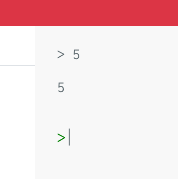
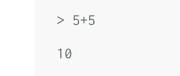
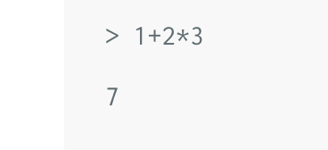

# Getting Started with BoGL

:leaves: **This tutorial covers:**
- The BoGL basics
- The BoGL Online Tool
- The interpreter
- The editor
- Games
- Comments

:deciduous_tree: **At the end, you should be able to:**
- Describe the editor and interpreter
- Write a simple expression
- Run an expression in the interpreter
- Define a game
- Write comments

## BoGL Basics

Getting started with BoGL is straightforward, as you can start coding directly in our [online tool](https://bogl.engr.oregonstate.edu/).

You can also watch our [Getting Started with BoGL video](https://media.oregonstate.edu/media/1_d5w6ypwr) (shown below), which goes over this same material, and quickly gets you writing your first BoGL program.

<iframe id="kaltura_player" src="https://cdnapisec.kaltura.com/p/391241/sp/39124100/embedIframeJs/uiconf_id/22119142/partner_id/391241?iframeembed=true&playerId=kaltura_player&entry_id=1_d5w6ypwr&flashvars[localizationCode]=en&amp;flashvars[leadWithHTML5]=true&amp;flashvars[sideBarContainer.plugin]=true&amp;flashvars[sideBarContainer.position]=left&amp;flashvars[sideBarContainer.clickToClose]=true&amp;flashvars[chapters.plugin]=true&amp;flashvars[chapters.layout]=vertical&amp;flashvars[chapters.thumbnailRotator]=false&amp;flashvars[streamSelector.plugin]=true&amp;flashvars[EmbedPlayer.SpinnerTarget]=videoHolder&amp;flashvars[dualScreen.plugin]=true&amp;flashvars[hotspots.plugin]=1&amp;flashvars[Kaltura.addCrossoriginToIframe]=true&amp;&wid=1_57gsb26m" width="640" height="420" allowfullscreen webkitallowfullscreen mozAllowFullScreen allow="autoplay *; fullscreen *; encrypted-media *" sandbox="allow-forms allow-same-origin allow-scripts allow-top-navigation allow-pointer-lock allow-popups allow-modals allow-orientation-lock allow-popups-to-escape-sandbox allow-presentation allow-top-navigation-by-user-activation" frameborder="0" title="Kaltura Player"></iframe>

<br/>
## Using the BoGL Online Tool

When you access the [online tool](https://bogl.engr.oregonstate.edu/) you should see the following page:


On this page there are 2 main areas of focus: the **editor** (to the left) and the **interpreter** (to the right).

The white screen on the left is the **editor**, this is where you can type in your code to run. A simple BoGL program might be written as follows in the white portion of the screen on the left:
```
game Example

test : Int
test = 12345
```
You may not know exactly what this does yet, but that's okay, we'll get to it later in the tutorial. The important part here is to understand the layout of the tool. Make sure you type this into the white section, and that the tab at the top has 'Code' selected (not Prelude). The default is to have 'Code' already selected.


The gray section on the right is the **Interpreter**. It repeats the process of reading the command you entered, evaluating it, and displaying the result. This may sound a bit fancy, but if you type something like `5` into the Interpreter, and hit **Enter**, you'll get back `5` (since 5 is 5!).



The simplest explanation for what an *expression* is in BoGL, is code that will evaluate to some value. The interpreter will take expressions and return what they evaluate to. Typing in a simple expression like `5+5` will give you back `10`, or `1+2*3` will give you back `7`. Feel free to play around with some other operators like subtraction or division, and to get a feel for how you can type in and use expressions.





This same gray section is where you can run your BoGL programs, and check the results of interpreting what you typed in. You can also get feedback for errors and issues. When you start a game, you will be able to interact with it from this screen as well. Think of this like your window into the BoGL computer, where you can talk to it, and it can talk back to you. In the case of the simple `Example` program we wrote before, you can type `test` into the interpreter, hit **Enter**, and you should get back an Integer of `12345`!


One thing that you should keep in mind is that you must have a valid program in the editor (the left white screen) to be able to run anything in the interpreter. This is because BoGL evaluates what you type into the interpreter after first preparing everything you wrote in the white screen. If you have a mistake there, it won't be able to get ready to work, and it will indicate that with an error message of some form. If your BoGL program on the left screen is correct, it will be able to prepare and allow you to evaluate expressions normally; as well as have access to anything you wrote in your BoGL program. Any updates you make in the editor on the left will be reflected in the interpreter expression you enter afterwards.

<br/>
## Defining your Game
Since BoGL is a game themed language, every BoGL program must begin with a game name. You can choose anything for this as long as it is a valid string (no weird characters), starts with a capital letter, and is preceded by the keyword `game`. Below is an example of the simplest program you can make in BoGL.

game SimplestProgram


<br/>
## Using the BoGL Tutorial Tools
BoGL code can be created and executed using the [BoGL Online Tool](https://bogl.engr.oregonstate.edu/).
In addition to this tool, there there are also smaller BoGL interfaces that can be found within these tutorial pages, like the one shown below.


Just like the main tool, these tools are comprised of two main parts:
- The *editor* (multi-line textbox on the left) for writing BoGL program code.
- The *interpreter* (single-line input box on the bottom right) for running BoGL expressions.

:dart: **Excercise:**
1. Type the simple expression `2 + 2` into the interpreter of the interface above and press the **Enter** key. What gets returned?
2. In the editor, change the lowercase letter 'g' in the word `game` to an uppercase letter 'G'. What happens now when you enter `2 + 2` into the interpreter?

<br/>
### Tools with a Fixed Interpreter

Some of the tutorials on this site will have a tool with a fixed interpreter, like the one shown below.



<br/>
These interpreters have a button instead of a textbox.
Clicking the button will run pre-written expressions and check their resulting values.
This is done in order to check if the code in the editor is correct.
You'll find these interfaces in some of the excercise sections of these tutorials.

:dart: **Excercise:**  
Inside of the editor of the tool above, replace the code `-- PUT EXPRESSION HERE` with an expression that evaluates to `5`.

<br/>
## Comments
Sometimes it can be useful to include comments within your code. Anything written after a double dash `--` on a line will be interpreted as comment text, meaning that the interpreter will not interpret that text as BoGL code.
Text can also be marked as comments if it is enclosed by curly bracket-dashes `{- comment text -}`.


-- Anything after double dashes is comment text
game SimplestProgram -- even if code is on the same line.
{-
Comments can be
on multiple lines
if they are enclosed inside
of curly bracket-dashes
-}

