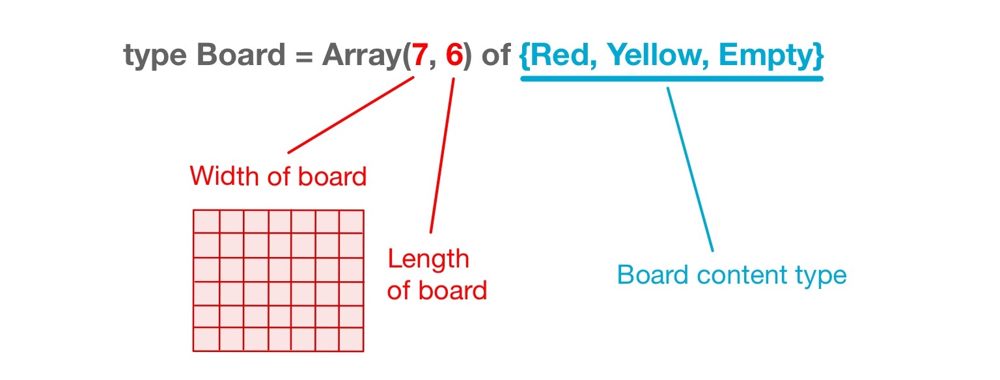

# Boards

## Background: What is a BoGL Board?
BoGL wouldn't be a board game language if there weren't a way to create a board!
In BoGL the type *Board* is a name we use to describe *arrays*.
An [*array*](https://en.wikipedia.org/wiki/Array_data_structure) in computer science is a [*data structure*](https://en.wikipedia.org/wiki/Data_structure), which is a term used to describe an organization of stored data.
Arrays are one of the simpler data structures to understand because they are often used to describe organizations that resemble lists (with one-dimensional arrays) or grids (with two-dimensional arrays).
For example, in the game of [Chess](https://en.wikipedia.org/wiki/Chess) the pieces are organized on a grid of squares (the board), and in the game of [Candy Land](https://en.wikipedia.org/wiki/Candy_Land) the path that the players move upon can be described as a list of squares.

 
## Defining the Board Type

To create a board value we must first create a type for our board.
BoGL only allows for one board type definition in a program, and it must be defined before any value and function definitions.
To define our board type, we must first write the keyword `type` followed by `Board` followed by an `=`.
After the `=` we write the keyword `Array` followed by parenthesis `()`.
Within the parenthesis are where the board dimensions are specified with two integer values seperated by a comma.
These integer values correspond to the width and length of our board respectively.
Following the parenthesis containing the board dimensions we write the keyword `of` followed by the desired
type for each square on our board. Below are a few examples of board type definitions.

Shown below is how we might define a 3 by 3 [Tic-tac-toe](https://en.wikipedia.org/wiki/Tic-tac-toe) board.

type TicTacToeSquare = {O, X, Unmarked} -- Board square type

type Board = Array(3, 3) of TicTacToeSquare -- Board definition


Shown below is how we might define a 7 by 6 [Connect Four](https://en.wikipedia.org/wiki/Connect_Four) board.

type ConnectFourSquare = {Red, Yellow, Empty} -- Board square type

type Board = Array(7, 6) of ConnectFourSquare -- Board definition


We can also create the board without first naming the board's content type.

type Board = Array(7, 6) of {Red, Yellow, Empty} -- Board definition


:dart: **Excercise:**  
Can you think of boards from other games that could have a type defined for them in BoGL?
Write down a few you can think of, then try writing out a type definition for one of them.

 
## Creating a Board Value

Using our defined board type, we can create board values.
Doing this is similiar to how we would create a value normally.
We start by creating a name for our board value (must be lowercase) followed by a `:`, followed by the type name `Board`.
After this we may then define *board equations*.
These are used to define the spaces on the board by giving them values.
Board equations consist of a name, a position, and an expression.

To create a board equation we must first write the name we chose for the board value, immediately followed by an `!` followed by parenthesis that contain the position values for which part of the board is being defined.
Following the parenthesis is an `=` which is then followed by an expression that should evaluate to the same type that the board is made up of.
In order for a board value to be defined, the board equation(s) must define a value for each part of the board.
Undefined values of any type (including Board) are not valid in BoGL, and will give you an error.

Below is the code for one of the simplest boards we can make, which is a 1 by 1 board that holds a Bool.

type Board = Array(1, 1) of Bool -- Board definition

-- Board value
boardValue : Board
boardValue!(1,1) = True -- Board equation defining the value for position (1, 1)


Below is the code for a 1 by 2 board that holds Bool values.

type Board = Array(1, 2) of Bool -- Board definition

-- Board value
boardValue : Board
boardValue!(1,1) = True  -- Board equation defining the value for position (1, 1)
boardValue!(1,2) = False -- Board equation defining the value for position (1, 2)


There is no limit to the amount of board equations you can write.
You can even create board equations that reference the same position.
These board equations will overwrite the value for the position that was defined by an equation above it.


type Board = Array(1, 2) of Bool -- Board definition

-- Board value
boardValue : Board
boardValue!(1,1) = True  -- Define the value for position (1, 1)
boardValue!(1,2) = False -- Define the value for position (1, 2)
boardValue!(1,1) = False -- Overwrite the value given for position (1, 1)


### Generalizing a Board Equation

If we wanted to initialize a Tic-tac-toe board with `Unmarked` values, we could do something like this:

-- Initial board value
initialTTTBoard : Board
initialTTTBoard!(1,1) = Unmarked
initialTTTBoard!(1,2) = Unmarked
initialTTTBoard!(1,3) = Unmarked
initialTTTBoard!(2,1) = Unmarked
initialTTTBoard!(2,2) = Unmarked
initialTTTBoard!(2,3) = Unmarked
initialTTTBoard!(3,1) = Unmarked
initialTTTBoard!(3,2) = Unmarked
initialTTTBoard!(3,3) = Unmarked


In the above value definition we specify the initial value (Unmarked) for each part of our board. Since a Tic-tac-toe board is 3 by 3, there are 9 total board positions we need to define values for (hence the 9 board equations).
This is many lines of code.
In this instance, since we are making each position on the board the same initial value, there is no real reason we should have to write 9 equations.

We can write this same initialization by generalizing a board equation to refer to all position values rather than to a specific one.
To create a board equation that refers to all board positions, we will write a board equation that has non-integer (lowercase) names instead of integers for the position values. This will tell the equation to refer to all board positions rather than just one. The example code shown below does the same thing as the code shown above (but in less lines)!


-- Initial board value
initialTTTBoard : Board
initialTTTBoard!(x,y) = Unmarked -- Board equation defining the values for all positions on the board


We can also give a non-integer value for just one of the position values.
This allows us to generalize a specific column or row of our board.


-- Initial board value
initialTTTBoard : Board
initialTTTBoard!(x,y) = Unmarked -- Set all values to Unmarked
initialTTTBoard!(1,y) = X -- Set the first column of values to X
initialTTTBoard!(x,3) = O -- Set the third row of values to O


 
## Accessing Board Contents
We can retrieve the values stored at the specific positions of a board value by typing the board value's name, followed by an `!`, followed by an `(Int,Int)` tuple value (which represents the position of the board we are accessing).

The function below takes a board and returns the top left value of the board.

boardFunc : Board -> TicTacToeSquare
boardFunc(b) = b!(1,1)


:dart: **Excercise:**  
Modify the `getBoardValue` function below so that it returns the value located at position (**posX**, **posY**) on the board (**posX** and **posY** are the names given to the arguments of the function).

{% include exercise_module_template.html
content = "game BoardExcercise

type TicTacToeSquare = {O, X, Unmarked} -- Board square type

type Board = Array(3, 3) of TicTacToeSquare -- Board definition

exampleBoard : Board
exampleBoard!(x,y) = Unmarked
exampleBoard!(1,1) = O
exampleBoard!(2,2) = X
exampleBoard!(3,3) = X

getBoardValue : (Board, Int, Int) -> TicTacToeSquare
getBoardValue(b, posX, posY) = b!(1,1)
"

checks="getBoardValue(exampleBoard, 1, 2)
getBoardValue(exampleBoard, 2, 2)
getBoardValue(exampleBoard, 3, 3)"

expects="Unmarked
X
X"
%}

 
:exclamation: **Note about the `!` character in relation to the `=` character:**
- The `!` is used on the **left** side of an `=` when we want to **assign** values to places on the board.  
- The `!` is used on the **right** side of an `=` when we want to **access** values at places on the board.

 
## Built-in Board Functions
BoGL has a few built-in functions for some common board procedures. Each of these functions has a parameter of type *Content*. The *Content* type is set to be a synonym of the type you define your board to be made up of. That is, if you define your board like this:

type Board = Array(3, 3) of TicTacToeSquare -- Board definition

Then the *Content* type definition behind the scenes will look like:

type Content = TicTacToeSquare


So make sure that the value you give as an argument to the *Content* type parameter is of the same type that you defined your board to be made up of.

### place
The `place` function allows you to place something on a board.

The function takes 3 arguments: A *Content* value that will be placed on the board, the board the *Content* will be placed on, and a pair of integers which represents the location of where on the board the *Content* value will be placed.
The return value of a `place` function call is the board value that was passed to the function updated with the `Content` placed at the specified position.

**Function Signature:**

place : (Content, Board, (Int, Int)) -> Board


:dart: **Excercise:**
1. Call the value `initialTTTBoard` in the interpreter below. What is the return value?
2. Enter the function call `place(X, initialTTTBoard, (2,2))` into the interpreter below. What is the return value?


### inARow
The `inARow` function will tell you if there is a row of values on a board.

The function takes 3 arguments: An integer which is the length of the row we are looking for, a *Content* value which is the value we are looking to see if there is a row of, and the board we are looking for a row in. The return value of an `inARow` function call is a Bool, which will be **True** if the specified row exists and **False** if it does not.

**Function Signature:**

inARow : (Int, Content, Board) -> Bool


:dart: **Excercise:**  
1. Call the value `noRowBoard` in the interpreter below? What gets returned?
2. Enter the function call `inARow(3, X, noRowBoard)` into the interpreter below. What gets returned?
3. Call the value `rowBoard` in the interpreter below. What gets returned?
4. Enter the function call `inARow(3, X, rowBoard)` in the interpreter below. What gets returned?
{% include code_module_template.html
content = "game PlaceExample
type TicTacToeSquare = {O, X, U} -- Board square type (U stands for Unmarked)

type Board = Array(3, 3) of TicTacToeSquare -- Board definition

-- Tic-tac-toe board without any rows of three
noRowBoard : Board
noRowBoard!(x,y) = O
noRowBoard!(1,1) = X
noRowBoard!(2,2) = X
noRowBoard!(3,2) = X
noRowBoard!(2,3) = X

-- Tic-tac-toe board with a row of three X values
rowBoard : Board
rowBoard!(x,y) = O
rowBoard!(1,1) = X
rowBoard!(2,2) = X
rowBoard!(3,3) = X
"
%}

### countBoard
The `countBoard` function will count the occurrences of a value on a board.

The function takes 2 arguments: A *Content* value which is what we are counting the occurrences of, and the board we are counting the occurrences in. The return value of `countBoard` is the occurrences of the specified value on the board.

**Function Signature:**

countBoard : (Content, Board) -> Int


:dart: **Excercise:**  
1. Call the value `tttBoard` in the interpreter below. What is the return value?
2. Enter the function call `countBoard(U, tttBoard)` into the interpreter below. What gets returned?
3. Enter the function call `countBoard(X, tttBoard)` into the interpreter below. What gets returned?
4. Enter the function call `countBoard(O, tttBoard)` into the interpreter below. What gets returned?


