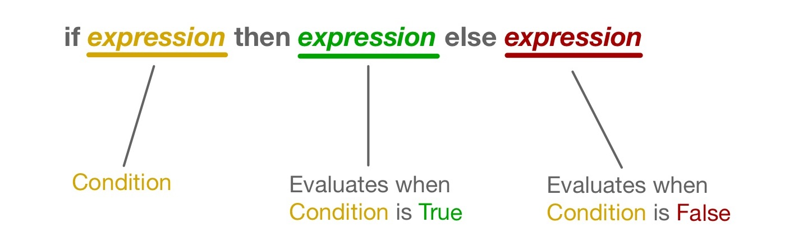

# Conditional Expressions (If/Else)

Sometimes you may want the resulting value of an expression to be dependent on a *condition*.
In BoGL you can write a *conditional expression*, also known as an *if/else statement* or *conditional statement*.
A conditional expression is composed of three sub-expressions.

To write a conditional expression, you must first write the keyword `if`, followed by an expression that evaluates to a Bool.
After writing this first expression, you write the keyword `then`, followed by a second expression (which does not have to evaluate to a Bool).
After writing this second expression, you then write the keyword `else`, followed by a third expression (which also does not have to evaluate to a Bool). The line below shows that this will look like written out, with the word *expression* being a placeholder for where an actual BoGL expression would be.

**if *expression* then *expression* else *expression***

The first expression (located after the keyword `if`) in a conditional expression is the condition. This expression will determine which of the next two expressions to evaluate.
The condition must evaluate to be a Bool(True or False) value.

The second expression (located after the keyword `then`) is what is evaluated when the condition is **True**.

The third expression (located after the keyword `else`) is what is evaluated when the condition is **False**.

 
:hammer_and_wrench: **Example: Coin Toss**  
Lets return to our example with Jack and Rosa, which we last visited in the [functions tutorial](./functions).  
The goal of the program below is to determine a first player for a game using a coin toss result.


game WhoGoesFirst

type TossResult = {Heads, Tails}
type Player = {Jack, Rosa}

coin : TossResult
coin = Heads

determineFirstPlayer : TossResult -> Player
determineFirstPlayer(coinSide) = Rosa


The function *determineFirstPlayer* will return a *Player* value, and takes a *TossResult* value as an argument. Right now, no matter if the TossResult value is Heads or Tails, Rosa will always be returned by the determineFirstPlayer function. To change this function so that Jack or Rosa can be returned depending on the TossResult argument, we can use a conditional experssion.

The modified determineFirstPlayer function below will return Rosa or Jack depending on whether the value provided to it's TossResult parameter is Heads or Tails.

determineFirstPlayer : TossResult -> Player
determineFirstPlayer(coinSide) = if coinSide == Heads then Rosa else Jack


The condition of the *conditional expression* within this function is `coinSide == Heads`. If this expression evaluates to True (which happens when the function's argument is Heads), then the entire conditional expression will evaluate to Rosa. If the condition evaluates to False (which happens when the function's argument is Tails), then the entire conditional expression will evaluate to Jack.

:dart: **Excercise:**  
What happens when you type `determineFirstPlayer(Heads)` into the interpreter below?  
What happens when you type `determineFirstPlayer(Tails)` into the interpreter below?



## Nested Conditional Expressions

Conditional expressions can contain more conditional expressions.
A conditional expression contained within another conditional expression is refered to as a *nested conditional expression*.
These are useful for creating conditional expressions that can evaluate to more than two possible values.

:hammer_and_wrench: **Example: Dice Toss**  
Jack and Rosa decide to play a game that involves four more players: Husein, Amanda, Stanley, and Ursa.
Since there are now six players, they decide to use a six-sided die result to determine a first player.
Shown below is a program that takes a die roll result as input and outputs the name of the chosen first player.


game WhoGoesFirst

type DieRollResult = {One, Two, Three, Four, Five, Six}
type Player = {Jack, Rosa, Husein, Amanda, Stanley, Ursa}

determineFirstPlayer : DieRollResult -> Player
determineFirstPlayer(dieResult) = if dieResult == One then Jack
				  else if dieResult == Two then Rosa
				  else if dieResult == Three then Husein
				  else if dieResult == Four then Amanda
				  else if dieResult == Five then Stanley
				  else Ursa



:dart: **Excercise:**   
Jack and Rosa decide they want to determine who goes first in their game based off of three coin toss results instead of one.
If there are more heads than tails, then Rosa will be first player, otherwise (if there are more tails than heads) Jack will be first player.
Using nested conditional expressions, modify the `determineFirstPlayer` function in the editor below so that all three TossResult parameters are used to determine a first player.

{% include exercise_module_template.html
content = "game WhoGoesFirst

type TossResult = {Heads, Tails}
type Player = {Jack, Rosa}

determineFirstPlayer : (TossResult, TossResult, TossResult) -> Player
determineFirstPlayer(toss1, toss2, toss3) =
	if toss1 == Heads then Rosa else Jack -- MODIFY THIS DEFINING EXPRESSION
"

checks="determineFirstPlayer(Heads, Heads, Heads)
determineFirstPlayer(Heads, Heads, Tails)
determineFirstPlayer(Heads, Tails, Heads)
determineFirstPlayer(Tails, Heads, Heads)
determineFirstPlayer(Tails, Tails, Tails)
determineFirstPlayer(Heads, Tails, Tails)
determineFirstPlayer(Tails, Tails, Heads)
determineFirstPlayer(Tails, Heads, Tails)"

expects="Rosa
Rosa
Rosa
Rosa
Jack
Jack
Jack
Jack"
%}

:eyes: Click to see a solution (but try yourself first!)


game WhoGoesFirst

type TossResult = {Heads, Tails}
type Player = {Jack, Rosa}

determineFirstPlayer : (TossResult, TossResult, TossResult) -> Player
determineFirstPlayer(toss1, toss2, toss3) =
    if toss1 == Heads then
        if toss2 == Heads then
            Rosa
        else
            if toss3 == Tails then
                Jack
            else
                Rosa
    else
        if toss2 == Tails then
            Jack
        else
            if toss3 == Heads then
                Rosa
            else
                Jack



 
