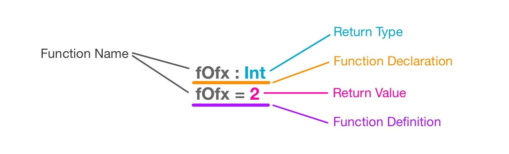
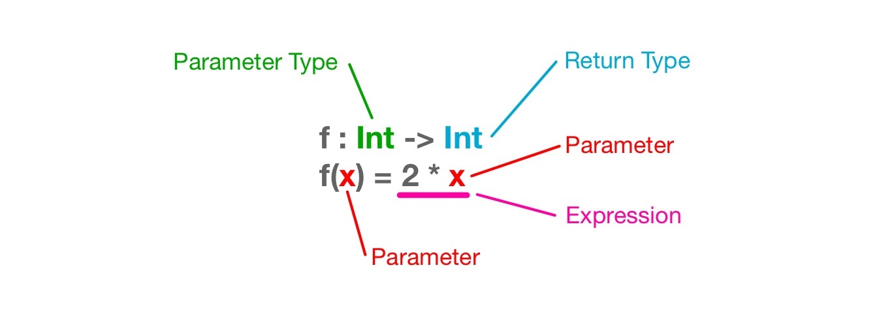

 
# Functions

:warning: Make sure that you have a solid understanding of [types](./types) before jumping into this tutorial.:warning:

Jack and Rosa want to play a board game. They decide that who gets to go first should be determined by the result of a coin toss.


game WhoGoesFirst

type TossResult = {Heads, Tails}
type Player = {Jack, Rosa}


So far we have the name of our game `WhoGoesFirst`, a type for capturing a coin toss result `TossResult`, and a type that can describe who the first player is `Player`. Now we need a way to get an actual TossResult value. Since BoGL is largely a [functional language](https://en.wikipedia.org/wiki/Functional_programming) we will do this by creating a _function_ that returns such a value. 

Functions inside of BoGL are used to output, or return, some sort of value. The value that is returned from a function is often determined by the inputs provided to the function. 
If the inputs do not have an effect on the output of a function, then that function will always return the same result. To illustrate this idea, observe the math function below.

**_f(x)_ = 2**

In this function, no matter the value of the parameter **x**, the output (return) of **_f(x)_** will always be 2. Below is what this function looks like in BoGL.

f : Int
f = 2

To create a function we need to write two things: A declaration and a definition.

The first part of a function is it's declaration. The declaration is where the types of the function's parameters (if there are any) and the type of the function's return value are declared. You can write a function declaration by first writing out the function's name. Opposite of type names, function names must start with a lowercase letter. In the above example our function is named _f_. After the name we write a colon `:`, which is followed by the parameter types (none in the above example), which are then followed by the output type. The above example takes no parameters, so it only needs its return type of `Int` declared.

The second part of a function is its definition. The definition is where all the logic goes that is used to determine the output value. The definition starts with the same function name that was written in the declaration, and then followed by an equals sign `=`. After the equals sign is where the logic that determines the output value goes. The code written in the function definition can often span multiple lines.

To actually utilize this function we must _call_ it. A function that has no parameters can be called by typing it's name. Try typing `f` into the interpreter (right side text box) below and press enter. It should return the value `2`.



Now that we know how to create a basic function that returns a value, lets go over how to make a function that takes a parameter. We will start with another math function as an example.

**_f(x)_ = 2x**

If we were to assign our parameter, **x**, the value of 3, then the value of **_f(x)_** would be 6. This function takes in a value for **x** and uses that to compute a value for **_f(x)_**, which in this case is **x** multiplied by two. We can also write this function in BoGL.

f : Int -> Int
f(x) = 2 * x


Since there is now a parameter that influences the output of the function, it must be accounted for in the function declaration. Parameters are written before the output value and are always followed by an arrow `->`. Reading the above function declaration for the function _f_ we know that it takes an integer type value as it's parameter and returns a integer type value.
The output value `2 * x` is what we call an [expression](https://en.wikipedia.org/wiki/Expression_%28computer_science%29). An expression is something that must be evaluated (like calculating 2 * 2) before it's value is determined. A function returns the result of evaluating an expression. We will cover expressions in detail in the next tutorial. For now lets utilize what we have learned so far to make a function that takes a coin toss result as an input and outputs a first player.

We will call this function _determineFirstPlayer_. It will take a _TossResult_ as a parameter and return a _Player_. Here is it's function declaration:

determineFirstPlayer : TossResult -> Player


Next we will define it's return value. For now we will define the return value to be _Rosa_.

determineFirstPlayer = Rosa


Together it will look like:

determineFirstPlayer : TossResult -> Player
determineFirstPlayer(result) = Rosa


To call a function that has a parameter you must first type the function's name, followed by parenthesis `()`. Inside of those parenthesis you must put a value that matches the type of the function's parameter. The function call `determineFirstPlayer(Heads)` will return the value `Rosa`.

You may notice that the _result_ parameter is not being utilized, and that the output of this function will always be _Rosa_, no matter if the _result_ is Heads or Tails. In the next tutorial we will look at how we can replace the value _Rosa_ with an expression that can evaluate to _Jack_ or _Rosa_ depending on the parameter _result_'s value. 

 
## Functions with Multiple Parameters
A function can have multiple parameters by using [tuples](./types.html#tuples).
