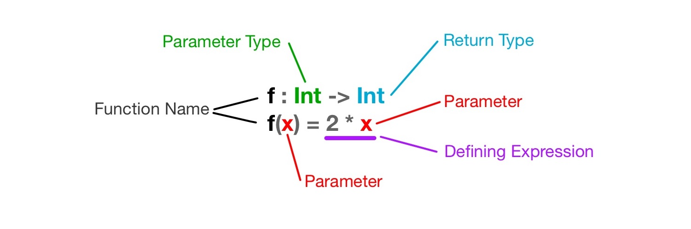

# Functions

:warning: Make sure that you have a solid understanding of [types](./types) and [values](./values) before jumping into this tutorial.:warning:

## Introduction
Jack and Rosa want to play a board game. They decide that who gets to go first should be determined by the result of a coin toss.


game WhoGoesFirst

type Player = {Jack, Rosa}
type TossResult = {Heads, Tails}

coin : TossResult
coin = Heads


So far we have the name of our game `WhoGoesFirst`, a type that can describe who the first player is `Player`, a type for capturing a coin toss result `TossResult`, and a defined TossResult value `coin`. Now we need a way to determine a FirstPlayer value using a TossResult value. Since BoGL is largely a [functional language](https://en.wikipedia.org/wiki/Functional_programming) we will do this by creating a _function_ that takes a TossResult value as input and returns a FirstPlayer value.

Functions inside of BoGL are used to output, or return, some sort of value. The value that is returned from a function is often determined by the inputs that are provided to it. To illustrate the idea of a function in BoGL, let's first take a look at the math function below.

**_f(x)_ = 2x**

This function takes in a value (x) which it uses to compute another value (double whatever value x is). In computer science terminology, **x** is what we call a *parameter*. If we were to assign our parameter, **x**, the value of 3, then the function would return the value 6. Shown below is how we can write this same function in BoGL.

f : Int -> Int
f(x) = 2 * x


To create a function we need to write two things: A declaration(first line) and a definition(second line).

#### Function Declaration
The first part of a function is it's declaration(also known as a *function signature*). The declaration is where the types of the function's parameters and the type of the function's return value are declared. You can write a function declaration by first writing out the function's name. Just like value names, function names must start with a lowercase letter. In the above example our function is named _f_. After the name we write a colon `:`, which is then followed by the parameter types (there is just one parameter in the above example), followed by an arrow `->`, and lastly followed by the output type. The above function has an integer parameter and returns an integer.

#### Function Definition
The second part of a function is its definition. The definition is where all the logic goes that is used to determine the return value. The definition starts with the same function name that was written in the declaration, which is then followed by parentheses that contain the names of the function parameters separated by commas (there are no commas in the above example because there is only one parameter). Parameter names, like function names, must start with a lowercase letter. Following the ending parentheses is an equals sign `=`. After the equals sign is where the defining expression goes. You can think of the defining expression as the logic that determines the return value.
The defining expression for the function above is `2 * x`. An [expression](https://en.wikipedia.org/wiki/Expression_%28computer_science%29) is something that must be evaluated (like calculating 2 * 2) before it's value is determined. A function returns the result of evaluating it's defining expression. We will cover expressions in more detail in the next tutorial.

#### Calling a Function
To actually utilize this function we must _call_ it. To call a function you must first type the function's name, followed by parenthesis `()`. Inside of those parenthesis you must put a value that matches the type of the function's parameter. We call this value a *function argument*. Try typing the function call `f(3)` into the interpreter below (right side textbox) and press the `enter` key. It should return the value 6.



Lets now utilize what we have learned so far to make a function that takes a coin toss result as an input and outputs a first player. We will call this function _determineFirstPlayer_. It will have a _TossResult_ as a parameter and return a _Player_. Here is it's function declaration:

determineFirstPlayer : TossResult -> Player


Next we will create its defining expression. For now we will make this the value _Rosa_.

determineFirstPlayer = Rosa


Together it will look like:

determineFirstPlayer : TossResult -> Player
determineFirstPlayer(coin) = Rosa


Try typing the function call `determineFirstPlayer(Heads)` into the interpreter below. It should return the value `Rosa`. You could also use `coin` as an argument for this function instead of `Heads`, since it's defined value is of type TossResult.



You may notice that the _coinSide_ parameter is not being utilized, and that the output of this function will always be _Rosa_, no matter if the argument is Heads or Tails. In the [if/else tutorial](./conditional_statements) we will revisit this example and look at how we can replace the value _Rosa_ with an expression that can evaluate to _Jack_ or _Rosa_ depending on the argument provided to the _coinSide_ parameter.

 
## Functions with Multiple Parameters
A function can have multiple parameters by using [tuples](./types.html#tuples). The function shown below takes two numbers and returns the result of adding them together.

f : (Int, Int) -> Int
f(a, b) = a + b


The number of parameters must correspond to the number of the function's parameter types.

-- The function below adds six numbers together.
f : (Int, Int, Int, Int, Int, Int) -> Int
f(a, b, c, d, e, f) = a + b + c + d + e + f


You still need to specify parameter names when using a previously defined tuple type.

type NumPair = (Int, Int)

-- The function below adds the two numbers inside of a NumPair together.
f : NumPair -> Int
f(a, b) = a + b; -- Still need to specify parameter names a and b

