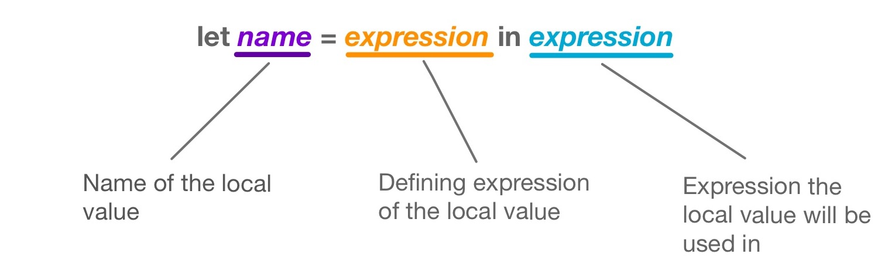

# Locally Defined Values

In the [values](values) tutorial we learned how to create values that we can use in our BoGL programs.
Whereas normal values can be used throughout multiple parts of your program, a locally defined value can only be used in a single specified expression.
This is useful if you know that a value is only needed for a single expression, or if you want to break an existing expression up into something more concise.
In BoGL, we can create locally defined values by using *let expressions*.

You can write a let expression by first writing the keyword `let` followed by the desired name of the value (must start with a lowercase letter), followed by an equals sign `=`. After the equals sign is where the expression of the locally defined value is defined. After this expression you must write the keyword `in`, followed by the expression that the locally defined value will be used in.


game LetExample

y : Int
y = let x = 10 * 2 in x / 5 + x


In the example above, we are using the locally defined value `x` in the expression `x / 5 + x`.
The expression in this example could also be written on a new line after the keyword `in`.


game LetExample

y : Int
y = let x = 10 * 2 in
    x / 5 + x


This kind of change can often increase the readability of our program, especially when it comes to writing more complicated expressions.

 
## Nested Let Expressions
The ending expression of a let expression can be another let expression.
A let expression that uses a value that was defined in an earlier let expression is called a *nested let expression*.
Nested let expressions can be useful if we want to define several values to use in an expression.
Shown below is an example of this.


game LetExample

x : Int
x = let a = 1 in
    let b = 2 in
    let c = 3 in
    let d = 4 in
    a + b + c + d


The defining expression of a local value in the let expression will always be evaluated before the expression which uses the local value (which is the expression that comes after the `in` keyword). Below is an example that illustrates this.


game SequentialLetExample

x : Int
x = let a = 1 + 1 in -- Evaluates first
    let b = a * 2 in -- Evaluates second
    let c = b + 3 in -- Evaluates third
    c * 4            -- Evaluates last


Shown below is a math equation that evaluates in an order that is identical to the program above.

**x = (((1 + 1) * 2) + 3) * 4**

 
