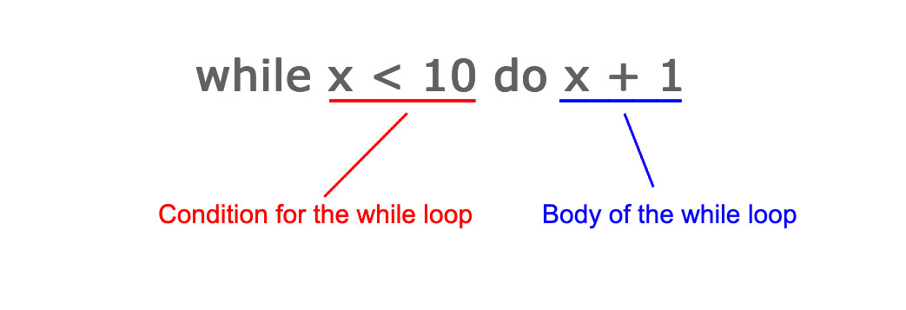

# Loops

## What are While Loops?

A while loop is an expression in BoGL that takes two other expressions, a condition and a body. The condition is an expression that evaluates to a result of `Bool`. The body is an expression that is evaluated every time the condition evaluates to `True`. A while loop repeatedly evaluates the condition, and for each time that it is `True` it evaluates the body again. If the condition evaluates to `False`, the while loop returns the last value produced by the body. If the condition evaluates to `False` on the first check, the body is never evaluated, and the value that was passed into the while loop is returned unchanged.

## How to write Loops

We begin with a `while` keyword. Following the `while` keyword, we give our condition. The **condition** can be any expression, so long as it produces a `Bool`. After the condition we write in `do`, which indicates that the body will follow. The **body** is an expression that is evaluated as long as the condition evaluates to `True`, and its result becomes the next value in the loop.

In the case of counting up to 10, our condition would `x < 10` and our body would be `x + 1`. So long as `x` is less than 10, our body will be evaluated, producing a new `x` with the value of the expression `x+1` until our condition returns `False`. This looks like the following in BoGL.



Notice that the value of `x` is updated after each time the body is evaluated. If we give a value of `x=7` to this while loop, we would get the following execution:

```
while 7 < 10 do 7 + 1
while 8 < 10 do 8 + 1
while 9 < 10 do 9 + 1
10
```

If we were to write this into a BoGL program, using functions, we could express this as the following. To try it out, you can run `count(0)` in the example below.



In the case where we call our function with a value greater than 10, like `count(15)`. We would get the same number back. Our condition `15 < 10` evaluates to `False`, and so the body is not evaluated. In this case, the while loop evaluates to the initial value of `x`.

## Context for Loops

Loops can only change the value that is in the immediate context preceding it. In the example above, the immediate context is the function parameter. The context is the immediate value that the while loop can change, and the only value that the while loop can change. There are two things that can set the context.

The first, **functions**, set the context to the parameter passed. If a function takes an `(Int,Bool)` pair, then the context of the following while is for that same `(Int,Bool)`.


-- counts to zero, and returns (0,b)
-- Context is for an (Int,Bool) tuple named (i,b)
f : (Int,Bool) -> (Int,Bool)
f(i,b) = while i > 0 do (i-1,b)


The second, **let expressions**, set the context to the named value that precedes the while expression.


-- Context is for an Int named 'x'
a : Int
a = let x = 5 in while x < 20 do x * 2


If you mix these, the rule is that the last one takes effect. Although the names from other contexts can be used, the type that the while produces must match that of the last context. Consider the following example:


game Ex

f : (Int,Bool) -> Int          -- 1st context, (Int,Bool) named (i,b)
f(i,b) = let x = True in       -- 2nd context, Bool named x
         let z = 5 in          -- final context, Int named z
         while z > 0 do z - 1  -- and so our while produces an Int, only changing 'z'


Keep in mind that if you have multiple contexts of the same type, you may only change the value of the most recent context. If you are not careful about this you can introduce an infinite loop by using a name in the condition that never changes.


game Ex

-- this will loop infinitely
-- as the condition is on a value that never changes.
-- x will always be 1.
infinite : Int
infinite = let x = 1 in -- 1st context is x of Int
           let y = 2 in -- 2nd context is y of Int
           while x > 0 do x - 1 -- the type is correct, but only y will update when we loop!


To remedy the situation above, we could change our while loop to update and check `y` instead. This is the only value we can change, as it is the last context before the while loop.

## Loops with Tuples

In some cases you may need to use a tuple to allow a loop to properly accumulate some value. If we wanted to calculate `num!`, we need to count down from `num` to 1 and store the product of all the numbers along the way. We can achieve this using a tuple of `(Int,Int)`, where the first `Int` will be `num` and the second `Int` will be our `product`. We must pass x and our product so that both of these can be in the same context, and thus both can be changed by the loop. Our while loop should also have a condition of `num > 1`. While this is true, we want to decrement our number by 1 and multiply our product by this number.


game Factorial
-- factorial takes (Number,Product)
-- ex. (5,1)
-- Our product must always start at 1 to produce the correct result

factorial : (Int,Int) -> (Int,Int)
factorial(num,prod) = while num > 1 do (num - 1, prod * num)


Now this example is a bit cumbersome, as we have to type in `factorial(5,1)`, and we get back `(1,120)`. We probably want to run `factorial(5)` and get `120` by itself. We can use another function, and our knowledge of contexts, to rewrite this into a simpler form.


game Factorial

-- get the 2nd element
snd : (Int,Int) -> Int
snd(a,b) = b

-- takes a num and 1, and returns the 2nd element of the while result
factComplex : (Int,Int) -> Int
factComplex(num,prod) = snd(while num > 1 do (num - 1, prod * num))

-- our new factorial function w/ a single parameter
factorial : Int -> Int
factorial(num) = factComplex(num,1)


And now we have a simpler factorial function that takes a single argument, passes it into `factComplex` (the old factorial function), and gets back the 2nd value in the tuple that is produced. You can test this out in the example below.

