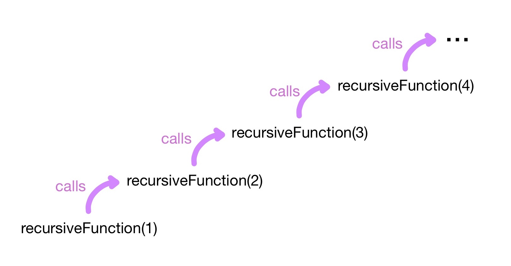
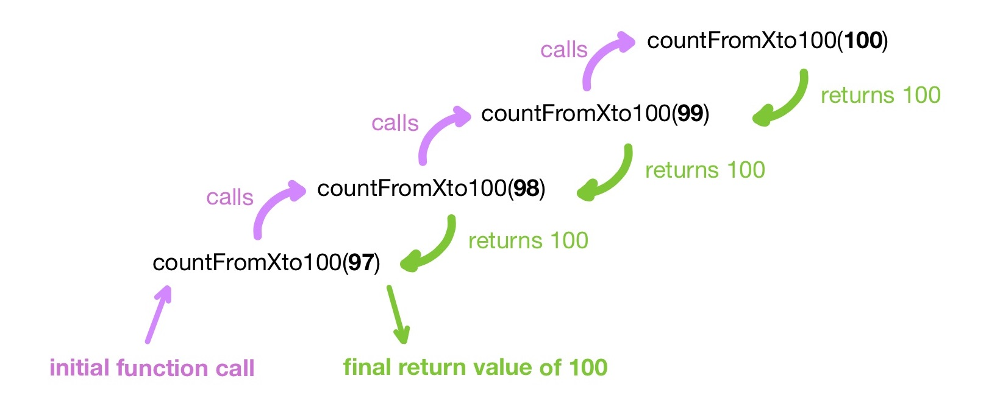

# Recursion

## What is Recursion?
Recursion is the act of a function making a call to itself. This technique is used to repeat computations, and can be used as an alternative to the [*while loop*](./loops).

Below is an example of what we would call a *recursive function*.


recursiveFunction : Int -> Int
recursiveFunction(x) = recursiveFunction(x + 1) 


The function `recursiveFunction` shown above is recursive because it has a call to itself within its defining expression `recursiveFunciton(x + 1)`.
This means that if it is called initially with an argument of `1`, `recursiveFunction` will make a call to `recursiveFunction` with an argument of `2`, which will then make a call to `recursiveFunction` with an argument of `3`, which will then make a call to `recursiveFunction` with an argument of `4`, and so on...

The function will repeatedy call itself like this and will not stop.

:dart: **Excercise:** 
- Try writing your own recursive function in the editor below.  
- What happens when you call the function in the interpreter?




## The Base Case
To prevent a recursive function from recurring forever, you must add a *base case*. The base case is described as when the argument provided to the function **will not** trigger another recurrence, and the function will instead return without calling itself again.

Reaching the base case in a recursive function often means an end to the repetition.
In this way, the base case acts similiarly to a while loop's condition.

Shown below is a recursive function that includes a base case.


countFromXto100 : Int -> Int
countFromXto100(x) = if x >= 100 then x
                     else countFromXto100(x + 1) 


The function shown above counts to 100, and will make 100 - x recursive function calls (assuming that x is less than 100).
In this function, the argument of every recursive call is the argument of the last call plus one.
The function will keep making these recursive calls until it reaches its base case, which is the argument being equal to or greater than 100.



Once a recursive call reaches the base case, the function will return a value to the last call, which then returns a value to the call before it and so on until a value is returned from the initial function call.

<br/>
:dart: **Excercise:**  
Write a function that takes an integer value as an argument, and makes an equivalent amount of recursive calls.  
The initial call to the function is not a recursive call. 



<details><summary>:eyes: Click to see a solution (but try yourself first!)</summary>
<p>

xRecursiveCalls : Int -> Int
xRecursiveCalls(x) = if x == 0 then x
                     else 1 + xRecursiveCalls(x - 1) 

</p>
</details>

<br/>
:dart: **Excercise:**   
A factorial operation is denoted in math using the exclamation point after an integer. This operation means to multiply the number by every integer that is less than itself and greater than zero. Shown below are a few examples.
```
4! = 4 * 3 * 2 * 1 = 24
3! = 3 * 2 * 1 = 6
2! = 2 * 1 = 2
1! = 1
11! = 11 * 10 * ... * 2 * 1 = 39916800

x! = x * (x - 1) * (x - 2) ... * 2 * 1
```
The last example shown above is a generalized form of factorial, where x represents the integer whose factorial is being calculated. 

Write the defining expression for a function that computes the factorial of an integer.




<details><summary>:eyes: Click to see a solution (but try yourself first!)</summary>
<p>

factorial : Int -> Int
factorial(x) = if x <= 1 then 1
               else x * factorial(x - 1)

</p>
</details>

<br/>

## Examples

Here are a couple of BoGL programs that utilize recursion.

:hammer_and_wrench: **Example: Guess My Favorite Color**  
Ever try to guess a friend's favorite color?
Running the BoGL code shown in the example below will start a "Guess My Favorite Color" game.
The argument `favoriteColor` represents the color to be guessed.
Calling the function `playGame` (from the example below) will result in the user being repeatly asked for a color until the input matches the argument that was originally provided to `playGame`.

game GuessMyFavoriteColor

type Color = {Blue, Red, Brown, Green,
              Black, Grey, White, Pink,
              Purple, Orange, Yellow}

type Input = Color

playGame : Color -> Color
playGame(favoriteColor) =
    let guess = input in
    if guess == favoriteColor then guess
    else playGame(favoriteColor)


In this example, recursion is used to repeatedly prompt the user for input until the correct input (which was the argument progided to the *playGame* function) is provided.

<br/>
:hammer_and_wrench: **Example: Find the Goose**  
Imagine we would like to find the location of the first goose in a line of 5 birds. 

| Spot in line | 1    | 2    | 3    | 4     | 5    |
|--------------|------|------|------|-------|------|
| **Bird**     | Duck | Duck | Duck | Goose | Duck |

The `findGoose` function shown below will check each spot in a line of birds (starting at the spot given as argument) until it finds a spot that holds a goose. 


game DuckDuckGoose

type Bird = {Duck, Goose}
type Location = Int

-- The board is a line of Ducks and Geese
type Board = Array(5, 1) of Bird

type Input = Location

birdLine : Board
birdLine!(x, 1) = Duck
birdLine!(3, 1) = Goose -- Goose at spot 3 in line

-- The intitial argument of the findGoose function is 
--  the first spot we check for in the line.
findGoose : Location -> Location
findGoose(lineSpot) =
    if birdLine!(lineSpot, 1) == Goose then lineSpot
    else findGoose(lineSpot + 1)


In this example, recursion is used to iterate through the line of birds until the first goose is encountered.
