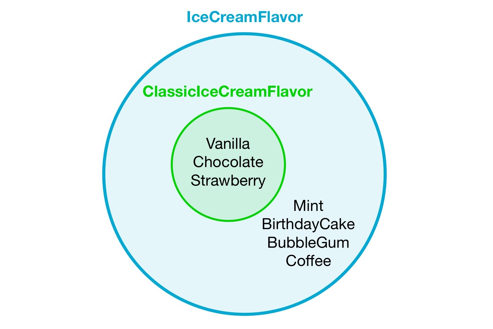

 
# Understanding Types

Jack and Rosa want to play a board game. They decide that who gets to go first should be determined by the result of a coin toss.

In these first few tutorials, we will create a program using the BoGL language that will take the result of a coin toss and choose who gets to go first based on that result.

In order to do this, our program must be able to...

1. Capture the inputted value of the coin toss result.
2. Output whether Jack or Rosa gets to go first based off of the result value.


We will start out by creating our game.

```
game WhoGoesFirst
```

Next we will capture the coin toss result. For this we are going to create a type that allows us to describe the result of a coin toss.


There are currently no defined types for a coin toss result (as there are for integers and booleans), so we will make one ourselves!
The pieces of information we need to create our own type are: 

* The name we want to call our type
* The possible values of our type

To define a type, we must first use the keyword `type` in our program, followed by the desired name for our type. It is required by the language that the first letter of this name is capitalized. We will then define what the possible values are for this type using the `=` operator, followed then by a list of the possible values, seperated by commas, and contained within `{}` brackets. These values will also be given desired names (with their first letters capitalized). It will end up looking like this:

```
type TossResult = {Heads, Tails}
```


Think of a type as a classification. We, as the programmer, must specify what information is allowed to be classified as our type. Below are a few more examples of user defined types that do not pertain to coin results, just to nail down the concept of defining types!

```
-- board game themed types
type CardSuit = {Diamond, Club, Heart, Spade}
type PlayerColor = {Blue, Red, Green, Yellow}
type DiceResult = {One, Two, Three, Four, Five, Six}
type ChessPiece = {Pawn, Bishop, Knight, Rook, Queen, King}
type ClueCharacter = {MissScarlett, ColonelMustard, MrsWhite, ReverendGreen, MrsPeacock, ProfessorPlum}
 
-- non board game themed types
type ClassicIceCreamFlavor = {Vanilla, Chocolate, Strawberry}
type WaterValveState = {Open, Closed}
type StateOfMatter = {Solid, Liquid, Gas, Plasma}
type VertebrateAnimal = {Mammal, Reptile, Amphibian, Bird, Fish} 
```

The examples seen above are what we call [enumerated types](https://en.wikipedia.org/wiki/Enumerated_type).
There are also two other types built into BoGL: integers and booleans.

```
Int -- Integer type
Bool -- Boolean type
```
Numbers are useful! The possible values of the type `Int` are all integer values (..., `-2`, `-1`, `0`, `1`, `2`, `3`, ...).

Sometimes we just need a binary value. The possible values of the type `Bool` are `True` and `False`.

<br/>
## Tuples
Sometimes it can be useful to have a type that will consist of value pairs. Think of a grid coordinate that has an X and Y value.
A tuple type can be created in the same way as a normal type, except instead of putting values surrounded by curly brackets `{}` after the equals sign `=`, you can put types surrounded by parenthesis `()`.
```
type Coordinate = (Int, Int) -- Tuple type for describing an XY coordinate.
```

Another example of a tuple is a standard card from a 52 card deck. Each standard card has two values: Suit and Rank. If we wanted to make a standard card type we could write out the 52 values that a card could possibly have, _or_ we could declare three types: Rank, Suit, and then Card which consists of a Rank and Suit pair.
```
type Rank = {Two, Three, Four, Five, Six, Seven, Eight, Nine, Ten, Jack, Queen, King, Ace}
type Suit = {Spade, Heart, Diamond, Club}

type Card = (Rank, Suit) -- Tuple type for describing a standard card.
```

Tuple types do not have to be only two values (despite how it sounds). Two is just the minimum amount of values a tuple can consist of.
```
type Card = (Rank, Suit) -- Tuple consisting of two types
type Hand = (Card, Card, Card, Card, Card) -- Tuple type that represents a five card hand. Consists of five Card types.

type Points = Int -- Normal non-tuple type
type Player = (PlayerColor, Hand, Points) -- Tuple type that represents a player in a card game. Consists of three different types.
```

<br/>
## Extended Types
Something useful that we can do with types is extend them. An extended type is created by taking an existing type and adding more possible values to it.
To create an extended type we must first define the name of the new type (just like creating a normal type), and then set it equal to the type we are extending, followed by an ampersand `&` and a new set of possible values surrounded by curly brackets `{}`. Below is an example of creating a new extended type (IceCreamFlavor) based off of an existing one (ClassicIceCreamFlavor).
```
type ClassicIceCreamFlavor = {Vanilla, Chocolate, Strawberry} -- Regular enumerated type
```

```
type IceCreamFlavor = ClassicIceCreamFlavor & {Mint, BirthdayCake, BubbleGum, Coffee} -- Extended type
```

Since IceCreamFlavor was created by extending ClassicIceCreamFlavor, its possible values consist of those that were in ClassicIceCreamFlavor (Vanilla, Chocolate, Strawberry) along with the new values that were defined (Mint, BirthdayCake, BubbleGum, Coffee).

Here is another example. Not all card games use Jokers, but some (like [Canasta](https://en.wikipedia.org/wiki/Canasta)) do. We can create a new type that allows for normal cards plus Jokers by extending a previously defined Card type.

```
type CanastaCard = Card & {Joker} -- Extended type
```

<br/>
## Examples of Types
Here are some examples of defining types in BoGL:
```
-- Normal enumerated types
type TossResult = {Heads, Tails}
type CardSuit = {Diamond, Club, Heart, Spade}
type PlayerColor = {Blue, Red, Green, Yellow}
type DiceResult = {One, Two, Three, Four, Five, Six}
type ChessPiece = {Pawn, Bishop, Knight, Rook, Queen, King}
type ClueCharacter = {MissScarlett, ColonelMustard, MrsWhite, ReverendGreen, MrsPeacock, ProfessorPlum}
type Rank = {Two, Three, Four, Five, Six, Seven, Eight, Nine, Ten, Jack, Queen, King, Ace}
type Suit = {Spade, Heart, Diamond, Club}
type ClassicIceCreamFlavor = {Vanilla, Chocolate, Strawberry}
type WaterValveState = {Open, Closed}
type StateOfMatter = {Solid, Liquid, Gas, Plasma}
type VertebrateAnimal = {Mammal, Reptile, Amphibian, Bird, Fish} 
type QuestionAnswer = {Yes} -- You are allowed to create a type that has only one possible value.

-- Types based off of the built in types
type TrueFalseQuestionAnswer = Bool -- Possible values are True and False
type Points = Int -- Possible values are any integer

-- Tuple types
type Coordinate = (Int, Int)
type Card = (Rank, Suit) 
type Hand = (Card, Card, Card, Card, Card) 
type Player = (PlayerColor, Hand, Points) 

-- Extended types
type IceCreamFlavor = ClassicIceCreamFlavor & {Mint, BirthdayCake, BubbleGum, Coffee} -- Extended type
type CanastaCard = Card & {Joker} -- Extended type
```
 
Here are some of the things you are <span style="color:red">**not allowed**</span> to do with types in BoGL:
``` 
type EmptyType = {} -- Every type needs at least one possible value.
type OneValueTuple = (Int) -- Tuples need two or more possible values.
type GamePiece = ChessPiece & ClueCharacter -- Types cannot be extended with types, only sets of possible values.
```

[Next, we'll show you how the program can utilize the TossResult type we created to capture user input!]()
